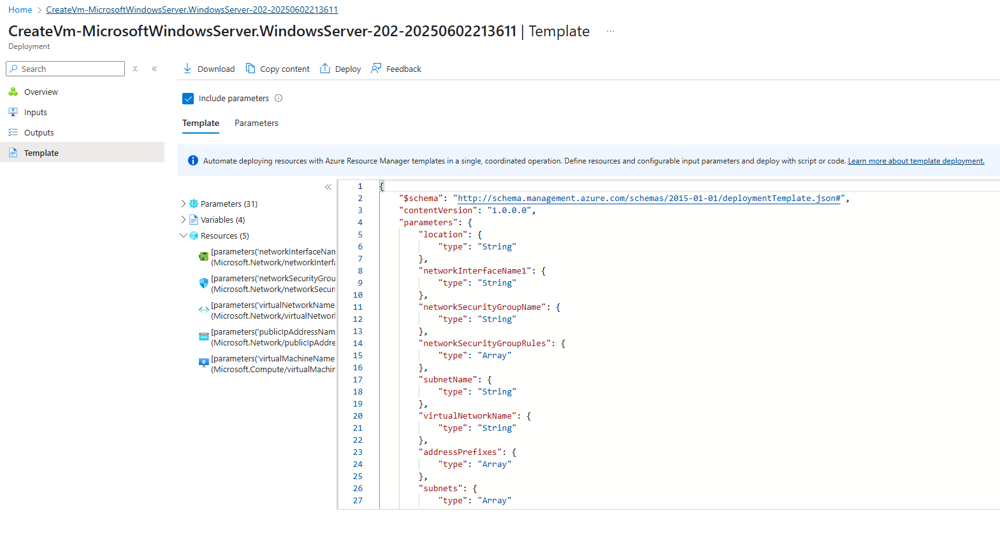

## Downloaded Azure Resource Template

After deploying my microsoft Windows Server 2025 to Azure VM.
I downloaded the Resource Templates to be able to easily deploy again.



## Converting Resource Template to Azure Bicep.

I launched the Datacenter server which had no windows UI.
I want to reuse my resource template files, but they are too hard. 
to work with directly. So I'm going to conver them to Azure bicep.

Install and Login to  Azure CLI

```sh
curl -sL https://aka.ms/InstallAzureCLIDeb | sudo bash
az login --use-device-code
```
Convert to Azure bicep

```sh
cd templates/vm
az bicep decompile --file template.json
```

After decompiling I noticed the files were still verbose.
It turns out that decompile will make the output 1:1 to json.
I asked ChatGPT to refactor the code to reduce the verboseness of the code. 

- We want Gen2, and arm64 is only available for Gen1 VMs.
- Also we only have preview images which might be bad for production use case.
- We could switch to gen1 but then we have to reduce security.
- Even switching to easus we cannot find a x86 image. So we are going to use preview arm64 in Canada.

## Conclusion 

- I was unable within the hhour to get this AZ bicep to deploy.
- There are challenges choosing the correct image type. 
- There are challenges knowing if we are set to Gen1 or Gen2 in our Azure Bicep.
- We'll ship the code for someone else to fix.
