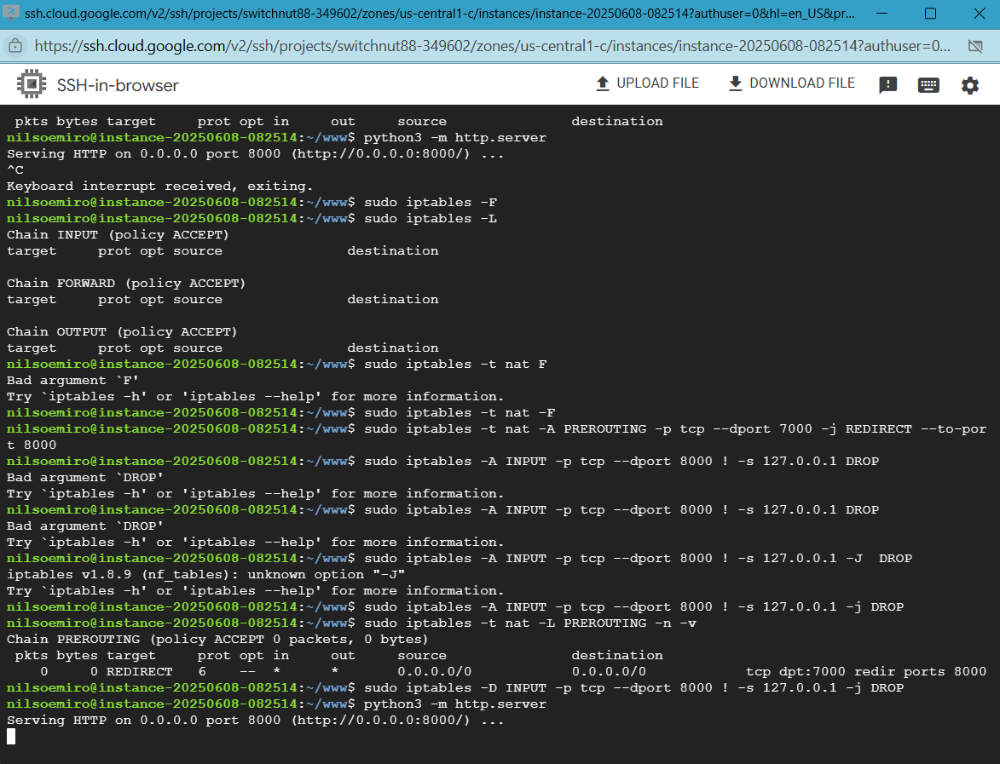

## Linux Firewall Rules

### Goal 

We want to see how easy or difficult it is to manage GCP firewall rules and linux firewall rules 

### Considerations 

We launched Debian latest version of GCP micro instance and we mainly utilized both the GCP's cloudshell and the SSH-in-browser. 

## Investigation 

- IPTables was already installed
- Python 3 was already installed

We were able to edit the iptables through command, direct editing iptables files wasn't possible and even if we could it's not recommended.

We could have ufw but we wanted to get experience with iptables since on some machines we might not be allowed to install packages.

Firewalld is the main firewall used for Red Hat instances and you can get this working in debian but you might have to install packages and get further investigation from other sources or maybe even a coding assistant. 

## Outcomes

- We were able to open port 7000,8000 in GCP firewall Rules.
- We were able to block port 8000 on iptables.
- We were able to redirect from 7000 externally to 8000 using iptables 
- We could not combine port 8000 block and redirect 7000 to 8000 but we suspect it's possible
- It seems that iptables is easy when utilizing an AI Coding Assistant eg. ChatGPT so there is no need for ufw unless we didn't have access to an LLM and we wanted to simply use man to quickly learn how to change rules or have an easy to remember how to change rules. 

