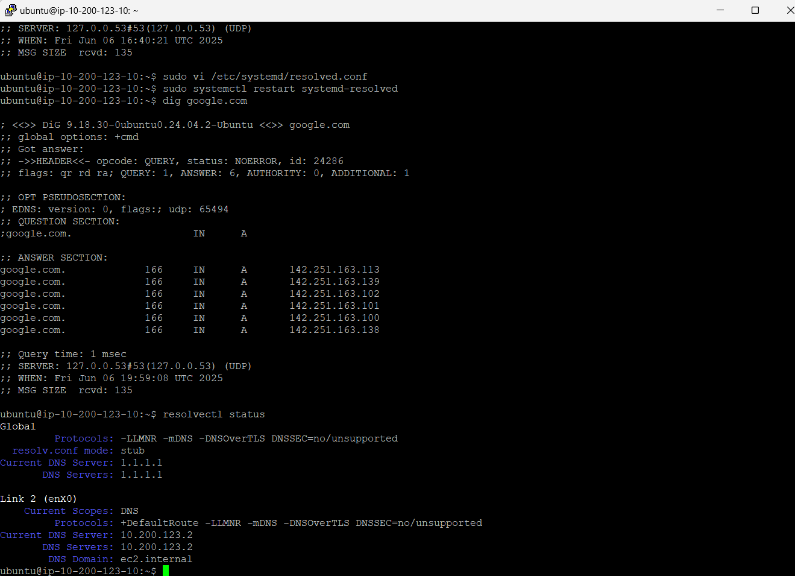

## Resolver



Edited the DNS resolver of the Ubuntu EC2 instance with `sudo vi /etc/systemd/resolved.conf`. This can also be done with `nano`.

When doing the command `sudo systemctl restart systemd-resolved` it will update the configuration file.

You can check if it was changed with `resolvectl status` 

## Wget vs Curl

the command wget is maily used for downloading webpages and websites, while curl is used for displaying content in the terminal. You can save outputs to a file with the -o option when writing the command 

```
curl google.com
```

```
wget google.com
```

