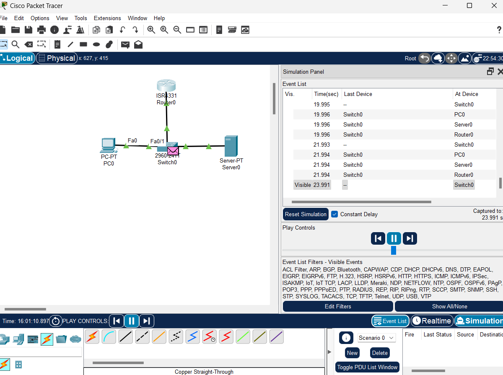
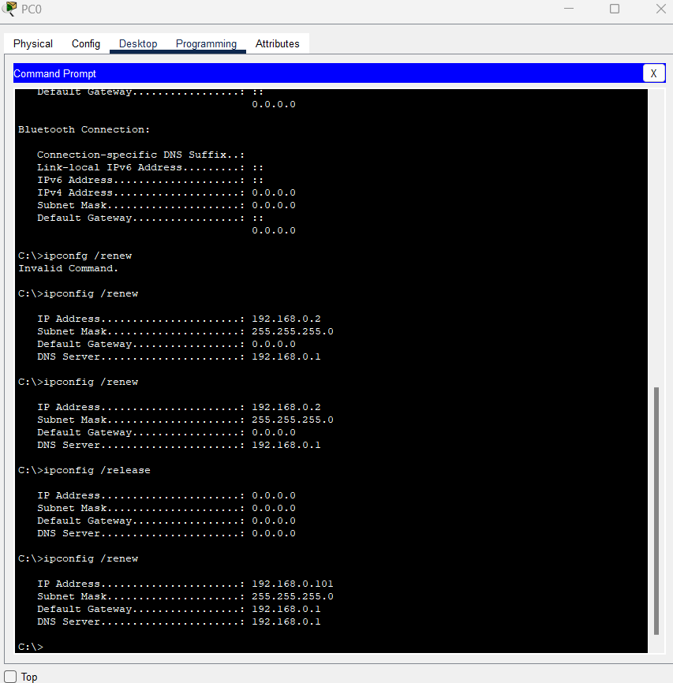
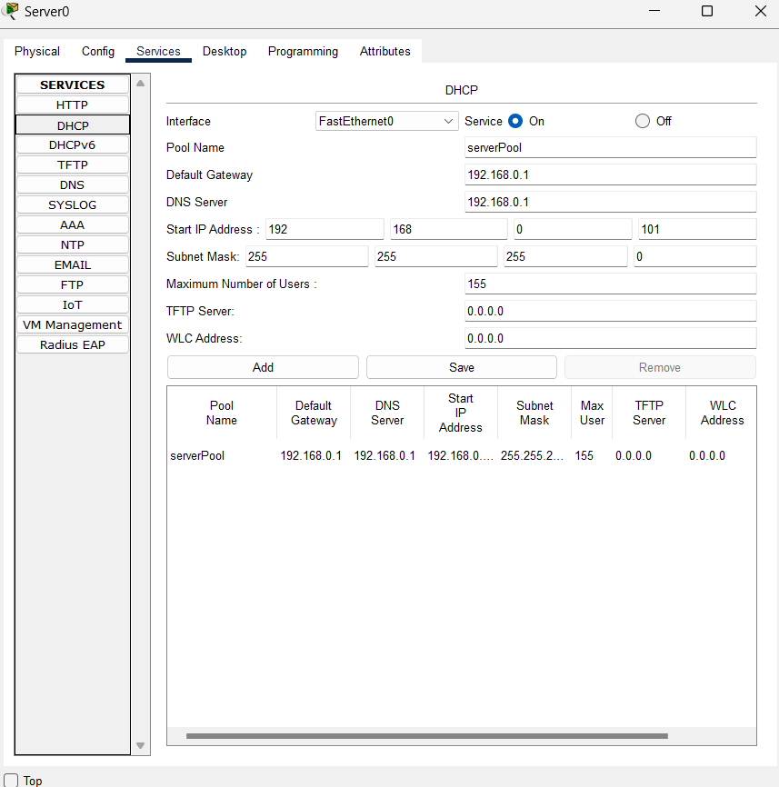
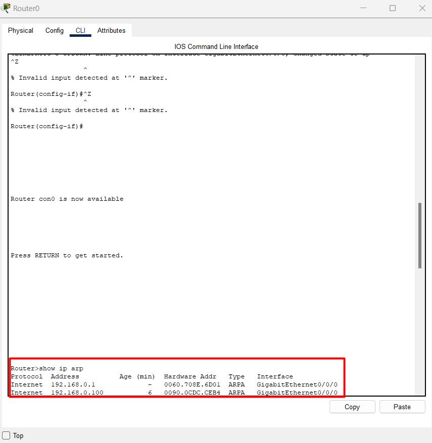

# State of the Network 

While exploring Packet Tracer I simulated a network that is connecting across multiple endpoints in a whole network, where a PC, is moving packets back and forth to a Switch, a Router and a Server.



In this simulation, I created an Address Resolution Protocol (ARP) where the PC device gets assigned an ip address of ```192.168.0.1``` within the alloted subnet mask of ```255.255.255.0```, this can be done through the ```Desktop option > Command Prompt``` when clicking the PC device on packet tracer, through the command ```ipconfig /renew```.



I also setup DHCP on the Server device so that an IP address can be automatically assigned from the Server.



The end result is the ip resolution from both the PC and the Server side where they pass packets around all other interfaces and each other.



