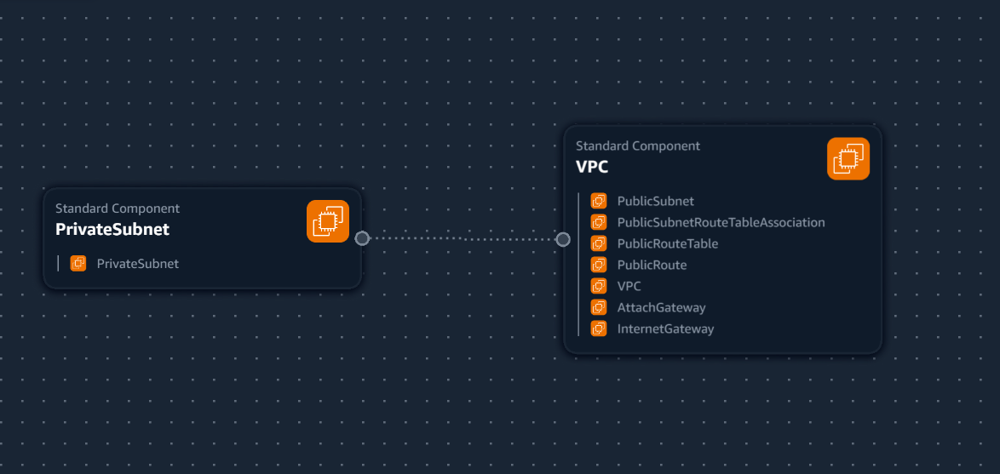
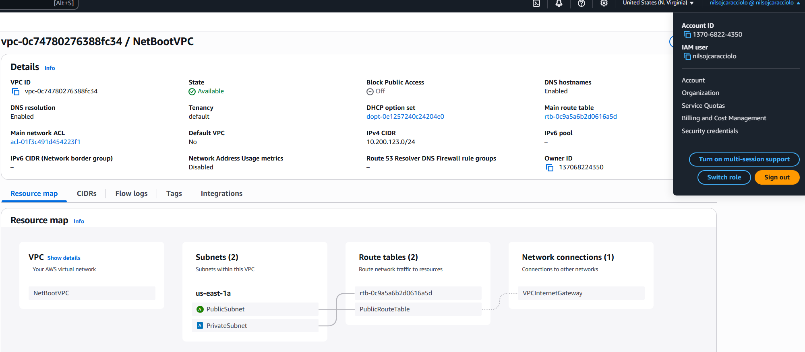

## VPC Settings

These are the vpc settings we observed tim set up for our cloud environment in AWS:

- VPC IPv4 CIDR Block: 10.200.123.0/24
- Ipv6 CIDR Block: No
- Number of AZ's: 1 
- Number of private subnet: 1
- Number of Public subnets: 1
- NAT Gateways: None
- VPC Endpoints: None
- DNS Options: Enable DNS Hostnames
- DNS Options: Enable DNS Resolution

## Geenerated and Review CFN Template

Watching the instructos videos, I noted the VPC Settings, rpovide this to LLM to produce the CFN template to automate the provision fo the VPC infrastructure.

## Generated Deploy Script

Using ChatGPT generated a bash script  `bin/deploy`

I changed the shebang to work with all OS platforms

- I had to ask the LLM to refactor the parameters so that it would not hardcode values and the template is more reusable. 
## Visualization  in Infrastructure Composer 

An example of the visualization of the vpc via the infraestructure composer

## Installing AWS CLI 

In order to deploy the aws cli we need to install it.

We follow the install instructions:
https://docs.aws.amazon.com/cli/latest/userguide/getting-started-install.html

## Deployed Resource to AWS

This is the resource map of the vpc deployed with CFN.

