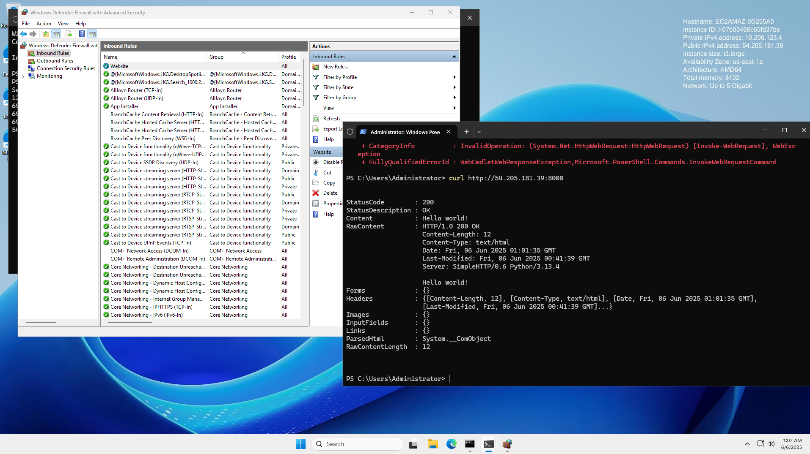

## Firewall Rules Testing Locally

When attempting to test firewalls locally, we determined it's hard to test when you are using localhost beacuse firewall rules will not block on same network soe we need to attempt to access the network on a different machine. 

## AWS Windows Server, Serving Simple Website

We were able to start a web server using python to serve a single static page.

The firewall rules block everything that does not have an inbound rule.

We added an inbound rule for port 8000, from our local machine we used Curl and were able to get a `Hello World` from our index.html file. 

We also have to add a security group that allows port `8000` on the AWS instance. 

