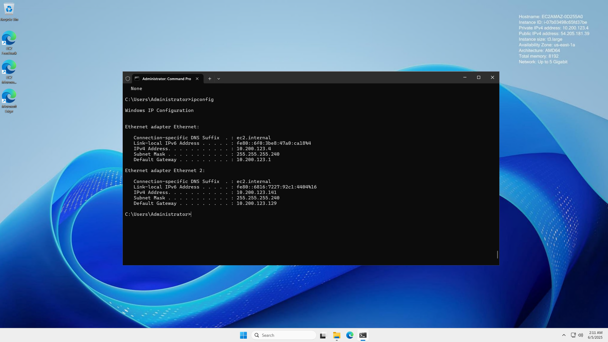
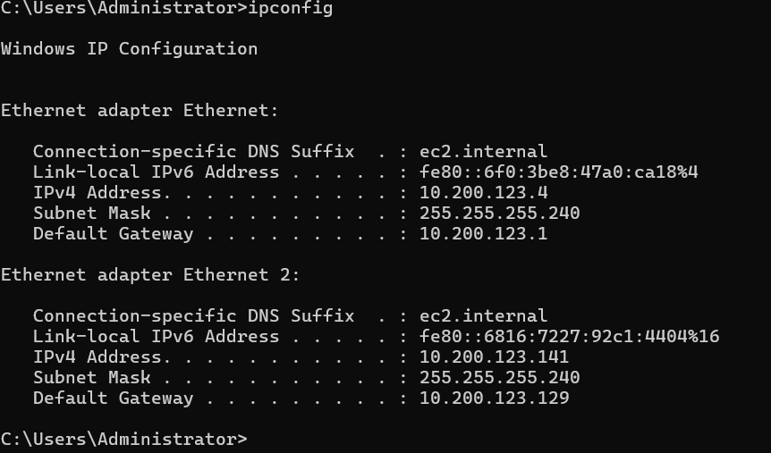

## Developer Environment



I launched an EC2 t3.large instance from AWS and this is how the environment looks.

## IPConfig
```
ipconfig
```

When we do the command, two default interfaces are shown up from the cloud environment spinned up from the set up lab.



## Ping 

```text
ping -t www.google.com
```

When pinging `www.google.com` reply packets will show up from the command prompt.

## Trace Route

```
tracert www.google.com
```

What this command does is that it will show how it takes for the packets to reach the destination IP address. It's measured in `hops`.

## Netstat 
```
netstat
netstat -a
netstat -b
netstat -r
```

What this command does is show the active protocol connections, whether `TCP` or `UDP` along with the port number and local ip addresses. `-a` displays all conections and `listening` ports.

 `-b` displays the executables involved in the creation of these connections, often described as services as well.

 `-r` displays the routing table of our network, showing an interface list and a `IPv4` and `IPv6` Routing table.

## Route 

```
route print
route ADD 157.0.0.0 MASK 255.0.0.0 10.200.200.1 IF 4
route ADD 157.0.0.0 MASK 255.0.0.0 10.200.200.1 IF 4 -p
route DELETE 157.0.0.0 MASK 255.0.0.0 10.200.200.1 IF 4
```

`route print` does the same thing as `netstat -r` does, showing the interface lists and routing tables.

The `route ADD` and `route delete`  commands allow modification of the routing tables list. this type of use case can be done to add an ip address that can be only accessible through a private network interface. `-p` makes the route permanent.