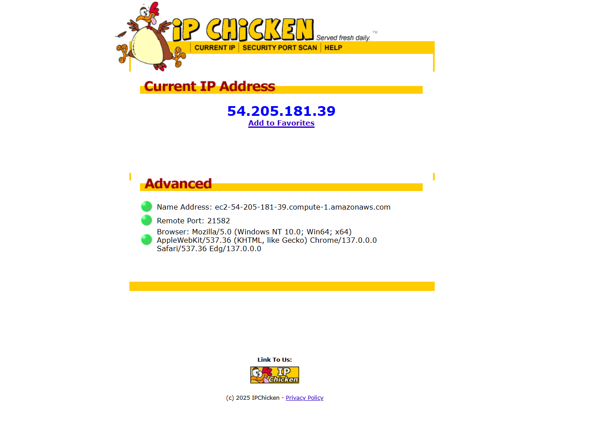

## Overview of Ubuntu Proxy Machine to Windows Proxy Machine

- With command `sudo tail -f /var/log/squid/access.log` we can find out if there is proxy tunneling happening from one network to the other 

## Final Result 

- Forward Proxy successfully showed the public IP of the squid proxy coming from the Ubuntu machine

