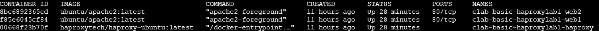

## Setting Up Container Lab 

To make the HA-proxy work, container lab is needed to be installed.

```sh
echo "deb [trusted=yes] https://netdevops.fury.site/apt/ / " | sudo tee —a /etc/apt/sources.list.d/netdevops.list
sudo apt update
sudo apt install containerlab
```

I had to get all the bash scripts from scratch using Deepseek LLM to make the HA-proxy work seamlessly with Docker.

```sh
#!/bin/bash

# Update package lists and install essential packages
apt-get update
apt-get install -y openssh-server sudo bash nano

# Prepare SSH directory and enable password authentication
mkdir -p /run/sshd
sed -i 's/#PasswordAuthentication yes/PasswordAuthentication yes/' /etc/ssh/sshd_config

# Create user with bash as default shell
useradd -m -s /bin/bash demo
echo 'demo:demo' | chpasswd
usermod -aG sudo demo  # Fixed the typo from 'username' to 'usermod'

# Create a basic .bashrc file for demo user
cat > /home/demo/.bashrc << 'EOF'
export PS1='\[\033[01;32m\]\u@\h\[\033[00m\]:\[\033[01;34m\]\w\[\033[00m\]\$ '
alias ls='ls --color=auto'
alias ll='ls -la'
EOF

# Set proper ownership
chown demo:demo /home/demo/.bashrc
``` 

This is one of the setup scripts included in the repository that will be used from this lab, including other scripts.

Then I proceeded to install docker.

```sh
sudo snap install docker
```

After installing, I created the files in the main directory for the ubuntu machine on AWS.

```sh
 sudo touch haproxylab.clab.yaml
 sudo touch proxy-startup.sh
 sudo touch replace-index.sh
 sudo touch setup-ssh.sh
 sudo touch web1.html
 sudo touch web2.html
 sudo touch haproxy-new.cfg
 ```
 
`Containerlab` will be now be used for deployment and the containers for `web1`, `web2` and `ha-proxy` will be created.

```sh
containerlab deploy
```

I noticed then that SSH access is not set up. To troubleshoot this, it is necessary to attach the container to the terminal and access it (in this case ha-proxy container) and then start the ssh service.

```sudo docker ps```





```sh
sudo docker exec -it 00668f23b70f /bin/bash
sudo docker exec -it f85e6045cf84 /bin/bash
sudo docker exec -it 8bc6892365cd /bin/bash
service ssh start
```

Checked the status of ssh.

```sh
service ssh status
```

To verify the configuration for our ha proxy I used command `cat /etc/haproxy/haproxy-new.cfg`.

Then, I inspected the status of the containers for the haproxer on container lab.

```sh
sudo containerlab inspect haproxylab.clab.yaml
```

I tried to connect to `web2` but I had a remote host error. This can be solved by using the `rm /home/ubuntu/.ssh/known_hosts` command.

By entering inside `web1` and `web2` containers, we can find out if our configuration has been applied successfully.

```
cd /var/www/html
cat index.html
```

I started the Windows Client instance in order to add the container lab route within the network and get the load balancer working.

```cmd
route add 172.20.20.0 mask 255.255.255.0 172.31.80.1
```

Then, I went to the routing table of the Windows instance on Amazon Web Services to edit the routes.

I tested the connectivity by going to the windows instance and doing a simple http request such as `http://172.20.20.2` and 'http://172.20.20.3'

It was a little hard to setup at first, mainly because we had to make sure that the security groups are point to each other (Ubuntu and Windows), had to make sure that the routing is added on the windows machine, and that the source check of the routing table along with the `172.20.20.0/24` CIDR would be set up as needed.

At first when deploying on containerlab a `503 service error` was received on the Ha proxy, and only web 1 and web 2 individually were working.

I then changed the `haproxylab.clab.yaml` file and added ` - haproxy-new.cfg:/usr/local/etc/haproxy/haproxy.cfg:ro`, which made the haproxy to work and perform load balancing. 


