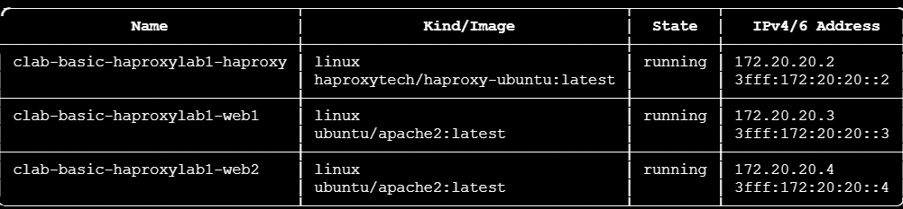
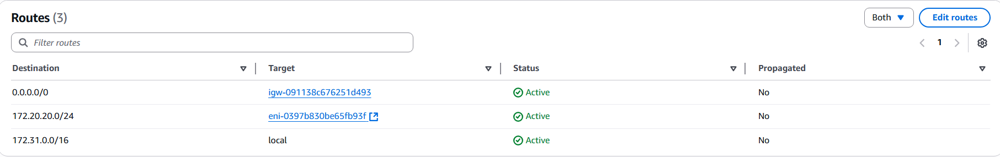
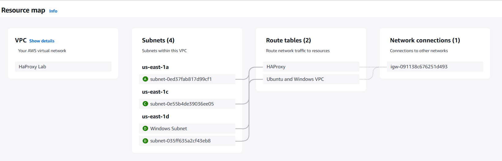
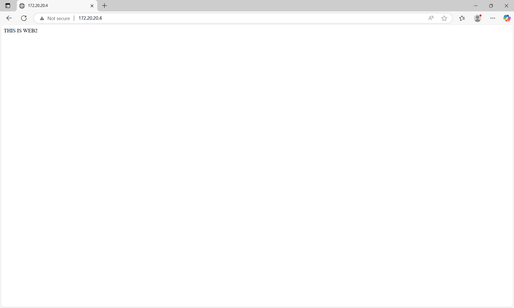

## Ubuntu Directory and Container Lab Setup

## Final Result 

- This is the routing table for HA proxy

- IP 172.20.20.3 working properly

- IP 172.20.20.4 which is the HA-Proxy IP Load balancing properly

