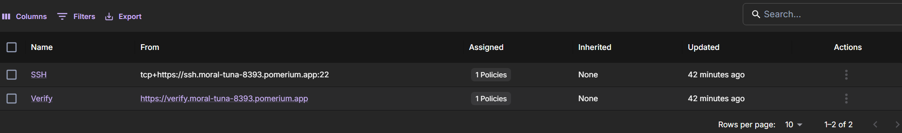
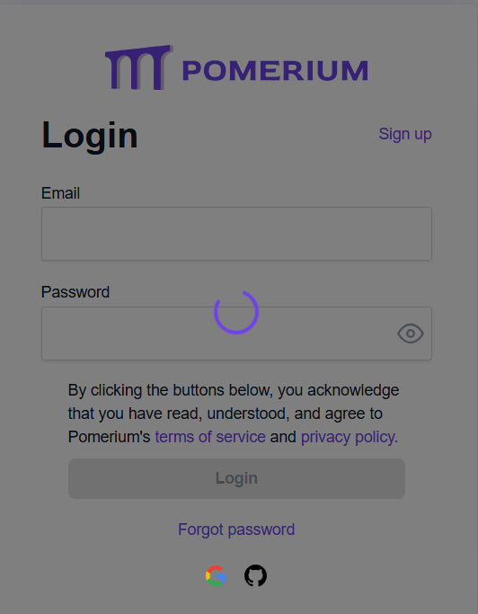
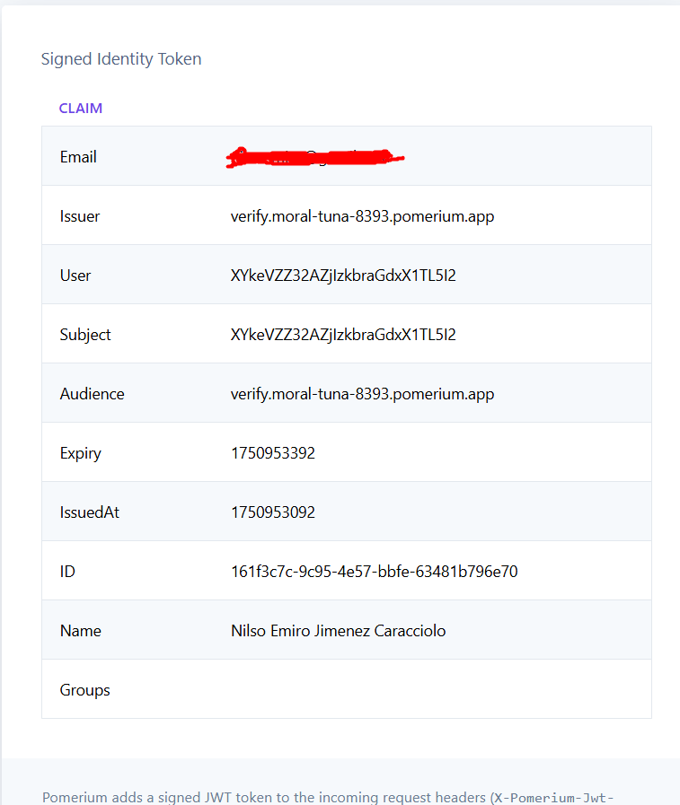
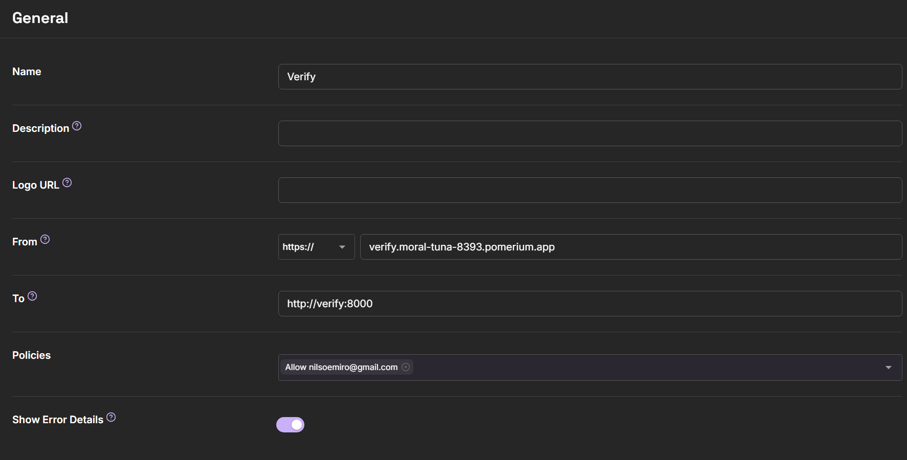

## Deploying Zero Trust Identity Aware Proxy with Pomerium

In this project, I will be showing the how to with steps and demostration of deploying an identity aware proxy with Pomerium, which showcases layers of security that can be executed more effectively than a VPN, for instance.

## Setup

This can be easily achieved by signing up to the website `https://console.pomerium.app/` and importing the `compose.yaml` generated from the application. Then, we will start with the process.

```sh
docker compose up -d
```

Then, we will head over to the verify routes to check one of the IAP urls.



We will verify with the verify route first. Upon opening the generated cluster link, a login page will appear.



After logging in, a confirmation token will appear along with request detail of the authorized email. 




Under the hood, this is running a reverse proxy but more secure and robust.



`https://verify.moral-tuna-8393.pomerium.app/` is the public facing address, while https://verify:8080 is the private address our docker container is pointing to. 

We can also create policies, which can manage who gets access to the proxy.


You can integrate this point of access on applications that can be both deployed on-prem and in the cloud.