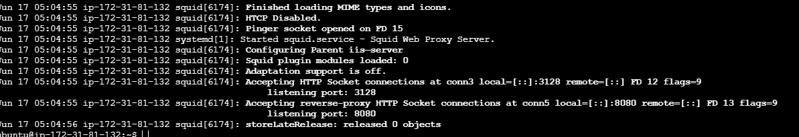
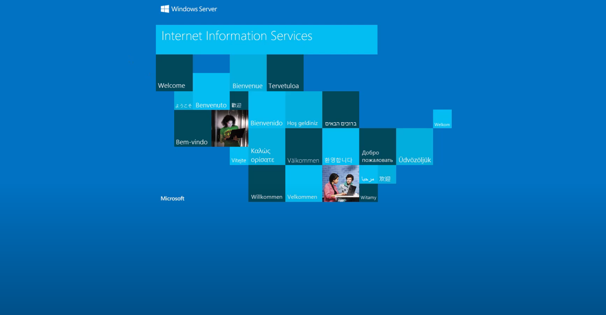

## Tools Deployed in AWS 
- Creation of a Windows IIS Server machine to serve the reverse proxy
- Creation of Ubuntu EC2 instance with port opened to 8080 to forward server to Windows Server.
## Final Result

- After starting squid server and configuring properly from the UbuntuBox to the Windows Box it starts the basic IIS landing page with `proxy-demo:8080`

