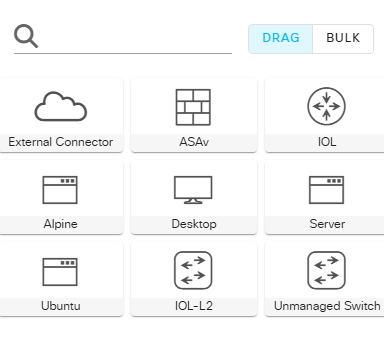

## Establishing a VPN Connection with a Virtual Private Gateway and Customer Gateway

Through this lab I learned how to establish the connection between the cml lab and AWS that is defined as a VPN network through VPC endpoints, creating a site-to-site.

After downloading the VPN configuration to be imported to the lab, I noticed it is less complex and more robust to include the interface name on the IPsec options. 

I started then getting the configuration imported into CML. 

```sh
enable 
conf t 
license boot level network-advantage addon dna-advantage
wr
``` 
The type of command used did not work with the current lab that I set up because the router has limitations on CML-Free.

Downloaded the new config for deploying the site-to-site VPN connection and making sure that the `cryppto keyring` and `crypto isakmp` profiles are pointing towards my local router IP on the lab, which is `192.168.1.1`.

Used the site-to-site policies on the router lab

```sh

crypto isakmp policy 200
  encryption aes 128
  authentication pre-share
  group 14
  lifetime 28800
  hash sha
exit


crypto keyring keyring-vpn-0f5ea20cc235cd2db-0
  local-address 192.168.1.1
  pre-shared-key address 34.205.97.1 key cmlvpn12345
exit

crypto isakmp profile isakmp-vpn-0f5ea20cc235cd2db-0
  local-address 192.168.1.1
  match identity address 34.205.97.1
  keyring keyring-vpn-0f5ea20cc235cd2db-0
exit

crypto ipsec transform-set ipsec-prop-vpn-0f5ea20cc235cd2db-0 esp-aes 128 esp-sha-hmac
  mode tunnel
exit

crypto ipsec profile ipsec-vpn-0f5ea20cc235cd2db-0
  set pfs group14
  set security-association lifetime seconds 3600
  set transform-set ipsec-prop-vpn-0f5ea20cc235cd2db-0
exit


interface Tunnel1
  ip address 169.254.243.142 255.255.255.252
  ip virtual-reassembly
  tunnel source E0/0
  tunnel destination 34.205.97.1
  tunnel mode ipsec ipv4
  tunnel protection ipsec profile ipsec-vpn-0f5ea20cc235cd2db-0
  ! This option causes the router to reduce the Maximum Segment Size of
  ! TCP packets to prevent packet fragmentation.
  ip tcp adjust-mss 1379
  no shutdown
exit

router bgp 65000
  neighbor 169.254.243.141 remote-as 64512
  neighbor 169.254.243.141 activate
  neighbor 169.254.243.141 timers 10 30 30
  address-family ipv4 unicast
    neighbor 169.254.243.141 remote-as 64512
    neighbor 169.254.243.141 timers 10 30 30
    neighbor 169.254.243.141 default-originate
    neighbor 169.254.243.141 activate
    neighbor 169.254.243.141 soft-reconfiguration inbound
! To advertise additional prefixes to Amazon VPC, copy the 'network' statement
! and identify the prefix you wish to advertise. Make sure the prefix is present
! in the routing table of the device with a valid next-hop.
    network 0.0.0.0
  exit
exit
```

I tried to configure the BGP to be able to properly connect with AWS

```
inserthostname-here(config)#router bgp 65000
inserthostname-here(config-router)#!
inserthostname-here(config-router)#address-family ipv4
inserthostname-here(config-router-af)#no network 0.0.0.0
inserthostname-here(config-router-af)#do sh run int E0/1
```

After checking the status of the routers and switches, `Tunnel1`  gets 50/50 connectivity

```
Interface              IP-Address      OK? Method Status                Protocol
Ethernet0/0            192.168.1.1     YES manual up                    up      
Ethernet0/1            192.168.2.1     YES manual up                    up      
Ethernet0/2            unassigned      YES TFTP   administratively down down    
Ethernet0/3            unassigned      YES TFTP   administratively down down    
Tunnel1                169.254.243.142 YES manual up                    down   
```
## Observations 

- There are no CAT8000V routers in the CML-Free version only CML personal or business, which limits the use case and implementation of the VPN since we can only use IOL, we only have so many nodes.

    

