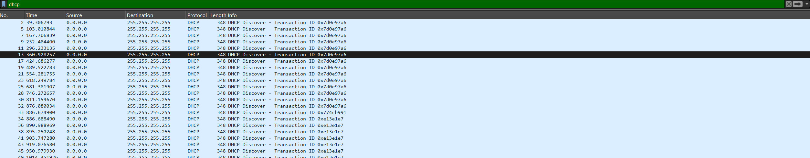

## Configuring CML Lab for Vshark 

With the same lab topology used in the other projects, I downloaded the packet capture for use in vshark. 

I started by disabling the interface `ubuntu`

```sh
sudo ip link set ens2 down
```

As I observe the changes in dhcp and packets, I turn up the interface again

```sh
sudo ip link set ens2 up
sudo netplan apply
```

This is to make sure that DHCP is being received on the interface, to be used with vshark. 

## Vshark Configuration

After importing the `pcap` file on Vshark, I filtered the packets with the word `dhcp`.



I set up an `icmp` filter on the VMware network adapter to find how many packets are being sent and received. 

It was easy to get a reading of the icmp packets, even though current lab has some limitations and complexities that are hard to debug.